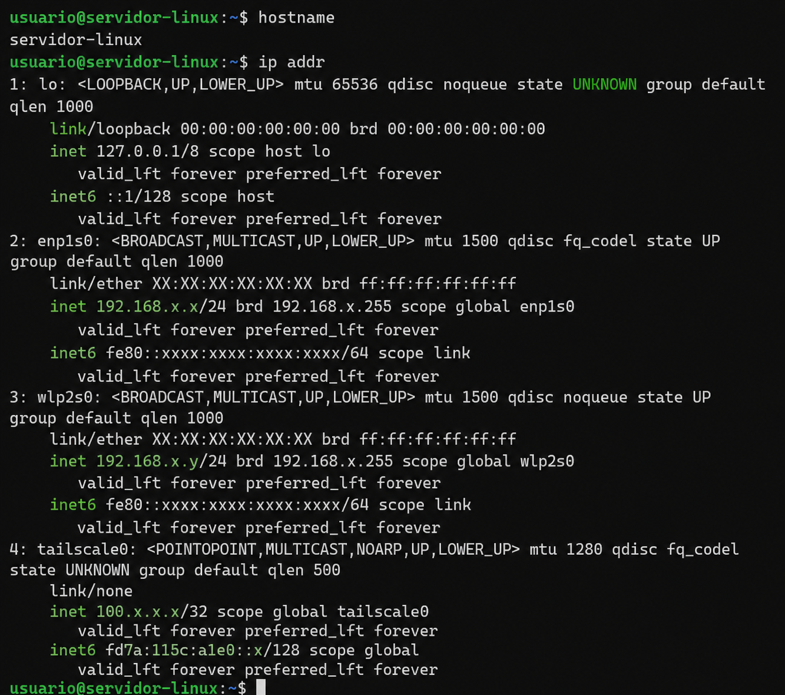
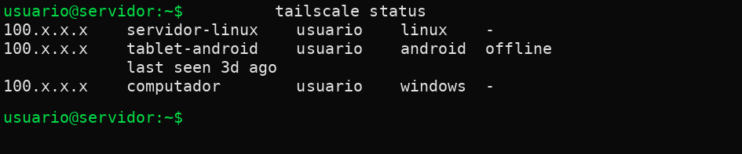

# 🖥️ Laboratório de Servidor Linux

## 📌 Sobre o projeto

Projeto de laboratório desenvolvido para estudar a implementação e administração de um servidor Linux em ambiente doméstico.

O servidor foi configurado para disponibilizar serviços de rede, compartilhamento de arquivos e acesso remoto seguro.

## 🎯 Objetivos

- Instalar e configurar um servidor Linux
- Configurar endereço IP estático
- Habilitar acesso remoto via SSH
- Configurar compartilhamento de arquivos com Samba
- Permitir acesso aos arquivos através da rede local
- Configurar acesso remoto ao servidor utilizando Tailscale
- Preparar o ambiente para futuros serviços de infraestrutura

## 🖥️ Infraestrutura

O servidor utiliza um notebook dedicado para laboratório.

Principais recursos:

- Linux
- SSD
- Memória RAM
- Conexão de rede
- SSH
- Samba
- Tailscale

## 🔐 Acesso remoto

O acesso remoto ao servidor foi configurado utilizando o Tailscale.

A solução permite acessar o servidor remotamente sem necessidade de expor diretamente o servidor à Internet através de redirecionamento de portas no roteador.

## 📁 Compartilhamento de arquivos

Foi configurado um servidor Samba para permitir o compartilhamento de arquivos através da rede.

O compartilhamento foi testado utilizando diferentes dispositivos da rede local.

## 🛠️ Tecnologias utilizadas

- Linux
- OpenSSH
- Samba
- Tailscale
- TCP/IP
- SMB

## 📚 Conhecimentos praticados

- Administração Linux
- Redes de computadores
- SSH
- SMB/Samba
- Endereçamento IP
- Acesso remoto
- Segurança de rede
- Administração de servidores

## 🖥️ Configuração do servidor

Evidência da identificação e configuração de rede do servidor Linux:

## 🔐 Acesso remoto com Tailscale

O servidor Linux foi configurado para acesso remoto utilizando Tailscale.

A configuração permite acessar o servidor de forma segura mesmo fora da rede local.

## 🚀 Próximos passos

O laboratório poderá futuramente receber novos serviços, como:

- Zabbix
- Servidor Web
- Serviços de rede
- Monitoramento
- Outros serviços de infraestrutura

## 👤 Autor

Projeto desenvolvido como laboratório prático de infraestrutura, redes e administração de sistemas.
